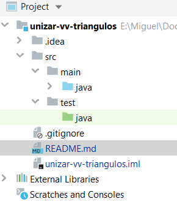
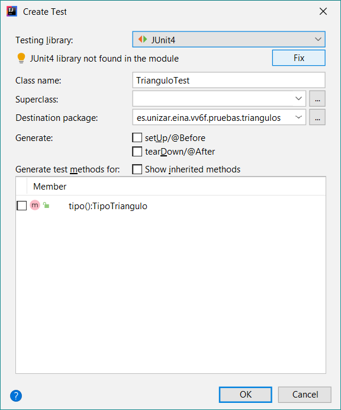
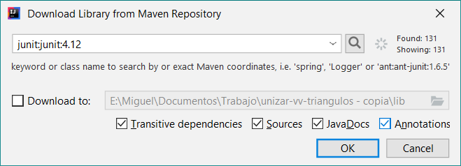

## Verificación y Validación
# Problema introductorio para la escritura de tests con JUnit

Plantilla de proyecto IntelliJ para resolver el problema de 
determinación del tipo de un triángulo en función de las
longitudes de sus lados.

Basado en Myers, G. J.; Badgett, T.; Sandler, C. (2011). 
_The Art of Software Testing_, 3rd Edition. John Wiley and Sons Ltd.


### Clasificación de los triángulos en función de las longitudes de sus lados

- Triángulo **equilátero**: aquel en el que sus tres lados tienen la misma longitud
- Triángulo **isósceles**: el que tiene dos y solo dos lados de la misma longitud
- Triángulo **escaleno**: el que tiene los tres lados de longitudes distintas.


### Determinación del tipo de un triángulo en función de las longitudes de sus lados

Los objetos de la clase `TipoTriangulo` enumeran los distintos
tipos de triángulos: `EQUILATERO`, `ISOSCELES` y `ESCALENO`.

La clase `Triangulo`, en su estado actual, consta simplemente de
un constructor que permite crear un nuevo `Triangulo` especificando
las longitudes enteras de sus tres lados y un método que devuelve el
tipo del triángulo a través de un valor de la enumeración 
`TipoTriangulo`. 


### Tareas

 1. Descargad el proyecto de Moodle o clonadlo desde GitHub.
 2. Abridlo desde IntelliJ o Android Studio (a través del menú `Open`, no desde el de `Import project`).
 2. El proyecto está configurado para utilizar el SDK de Java 8. Comprueba que el proyecto se puede compilar
    (menú `Build` → `Build Project`). Si obtuvieras algún error, puedes cambiar el SDK asociado al proyecto en
    `File` → `Project Structure...` → `Project Settings` → `Project` → `Project SDK`. 
 3. Observad la estructura del proyecto y, en particular, las clases `Triangulo`,`TipoTriangulo` y sus métodos.
 4. Para que los tests que escribamos con JUnit no se mezclen con el código fuente del proyecto,
    cread un nuevo directorio de código fuente denominado `test` y ubicado en el directorio `src`.
    Puede hacerse directamente desde IntelliJ o Android Studio a través del menú contextual (botón derecho) del
    directorio `src`.
 5. Dentro del directorio `test`, crea otro denominado `java`.
 6. Marcad este último como raíz del código fuente de test: menú contextual, opción `Mark Directory as` (está
    hacia el final del menú) y después `Test sources root`. El color del directorio tiene que cambiar a verde.
 7. Os ha tenido que quedar una estructura como esta:
 
    
 
 8. Cread un primer test para el método `tipo` de la clase `Triangulo`. Para ello, podéis abrir la clase
    `Triangulo` y ejecutar `Navigate` → `Test` y elegir `Create New Test`. En la ventana que aparece a continuación
	seleccionad `JUnit4` como `Testing library` y pulsad en el botón `Fix` que aparece debajo para que añada la
	biblioteca de JUnit 4 al _classpath_ del proyecto.
	
	
	
	
	
	Marcad las cuatro casillas de debajo y podéis hacer clic en `OK` sin esperar a que la búsqueda termine en Maven.
	
 9. Se habrá creado una clase denominada `TrianguloTest`. Comprobad como está en el mismo paquete que la clase 
    `Triangulo` (`es.unizar.eina.vv6f.pruebas.triangulos`), pero en directorios completamente separados del sistema
	de ficheros.
	
10. Escribe el test correspondiente al primer caso de prueba de la tabla de la trasparencia 41: 

	```java
    @Test
    public void comprobarTrianguloLados_3_3_3_esEquilatero() {
		Triangulo triangulo = new Triangulo(3, 3, 3);
		assertEquals(TipoTriangulo.EQUILATERO, triangulo.tipo());
	}
	```
11. Ejecútalo. Puedes optar por ejecutar solo este test pulsando en la flecha verde situada a la izquierda de la
    cabecera del método, o puedes ejecutar todos los tests de la clase pulsando en la doble flecha que aparece 
	junto a la cabecera de la clase.
	
12. El test no pasará, puesto que de la clase `Triangulo` solo os he proporcionado el esqueleto.

13. Escribe el código mínimo imprescindible en la clase `Triangulo` para que el test pase, siguiendo las explicaciones
    dadas en clase sobre TDD.

14. Ve repitiendo este proceso de forma incremental con el resto de los casos de prueba de la tabla de la
    transparencia 41:
	- Escribe un nuevo test.
	- Ejecútalo para comprobar que no pasa.
    - Escribe el código mínimo que haga que pase.
    - Reflexiona sobre la complejidad del código que tengas hasta el momento (ver el punto siguiente).

	Es posible que cuando añadas un nuevo test este pase directamente. Puede deberse a:
	- El diseño de las pruebas: hemos planteado un escenario de pruebas muy exhaustivo algunas son redundantes.
	  No te preocupes por ello y sigue adelante. 
	- Con algún test anterior, has escrito más código del estrictamente necesario para que ese test pasara. De
	  nuevo, no te preocupes, pero procura no _correr_ tanto a la hora de implementar funcionalidad.
	- El test que has escrito, por error, es un test trivial (sea cual sea el estado del código, siempre pasará).
	
15. Aunque el problema de determinar el tipo de un triángulo parece muy simple de resolver, en algún momento la
    cantidad de casos que estés contemplando en el código se disparará. Reflexiona sobre el código y piensa en
    alguna manera de simplificarlo. Ha esto se le llama _refactorización_ y, dado que tendrás ya una buena
    cantidad de test implementados, puedes afrontar la reescritura del código de con relativa seguridad, puesto
    que si introdujeras algún defecto en el código, alguno o varios de los test que ya tienes escritos debería
    dejar de pasar.
    
16. Conforme vayas escribiendo código y tests, ve midiendo la cobertura del código utilizando la orden
    `Run` → `Run with Coverage`, tal y como se explica en el vídeo correspondiente a la clase.
